# Diagrams

All UML, data-flow, ER and activity diagrams for UniCore.

| Diagram | Where |
|---------|-------|
| Use case | [below](#use-case-diagram) · [PDF (all UML + DFD)](./uml/uml_and_dfd.pdf) |
| Class | [below](#class-diagram) |
| Sequence | [below](#sequence-diagram) |
| Component | [below](#component-diagram) |
| Data flow (Level 0, Level 1) | [below](#data-flow-diagrams) |
| Activity | [activity/UniCore_Activity_Diagrams.pdf](./activity/UniCore_Activity_Diagrams.pdf) |
| ER (full, generated from the SQL schema) | [er/unicore_er_diagram.pdf](./er/unicore_er_diagram.pdf) · [interactive HTML](./er/unicore_er_diagram.html) |
| ER (per schema) | [er/by_schema/](./er/by_schema/) · [below](#er-diagrams-per-schema) |

Regenerate the full ER diagram after a schema change: `python3 diagrams/er/build_er_diagram.py`

---

## Use case diagram

## Class diagram
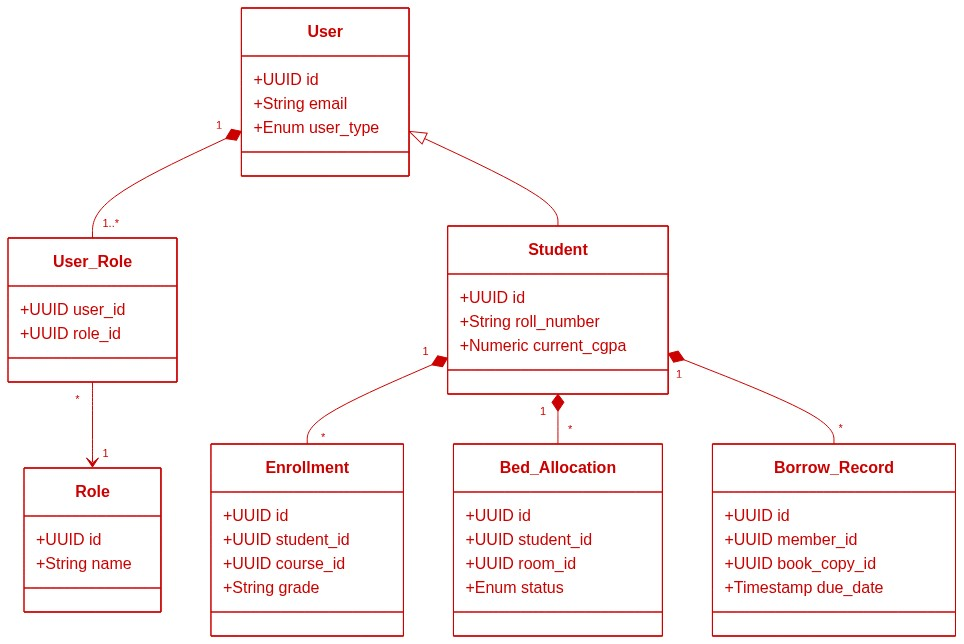

## Sequence diagram
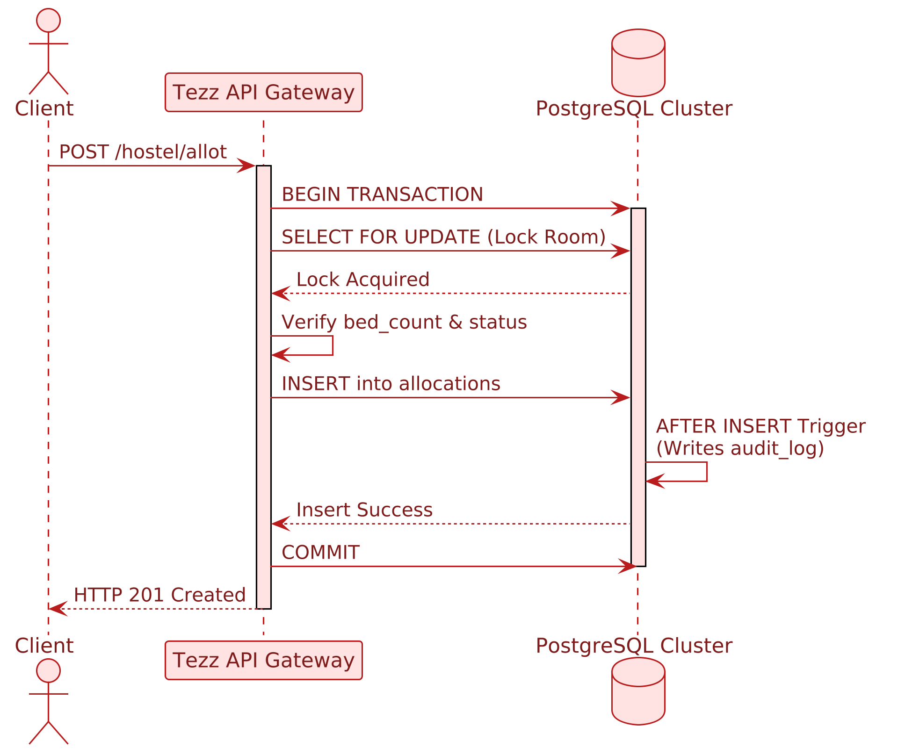

## Component diagram
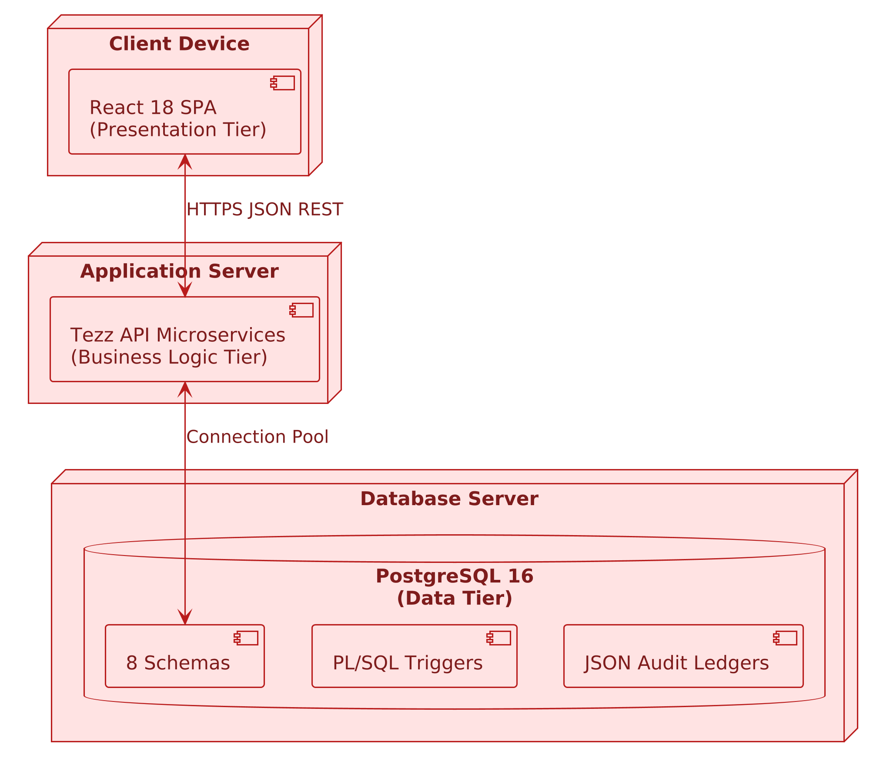

## Data flow diagrams
**Level 0 (context)**

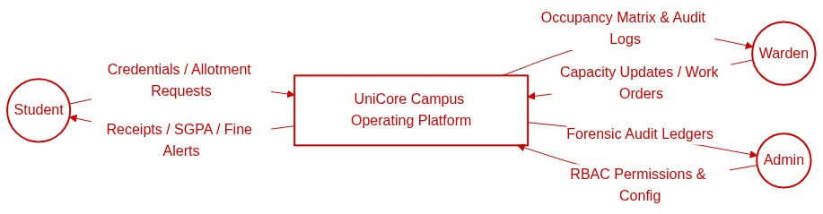

**Level 1**

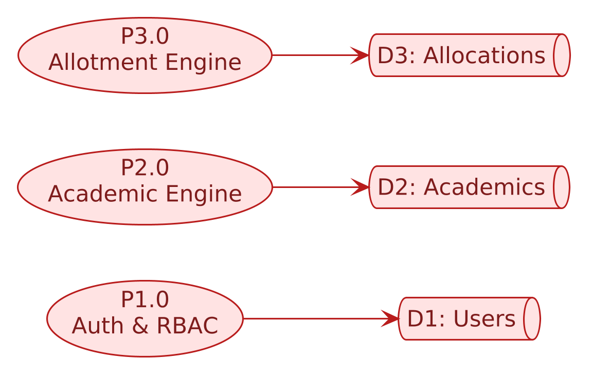

## ER diagrams per schema
| Schema | Diagram |
|--------|---------|
| Overview | 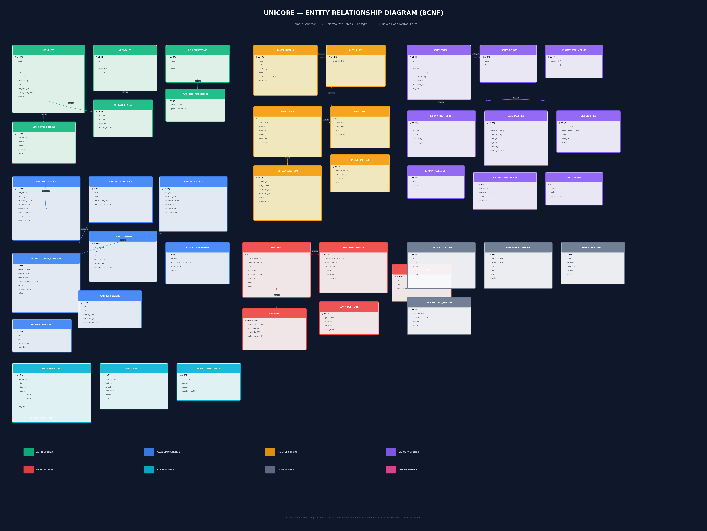 |
| Full connectivity | 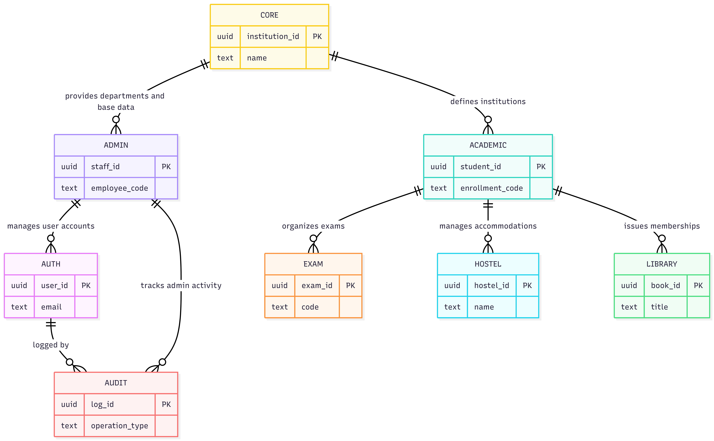 |
| auth | 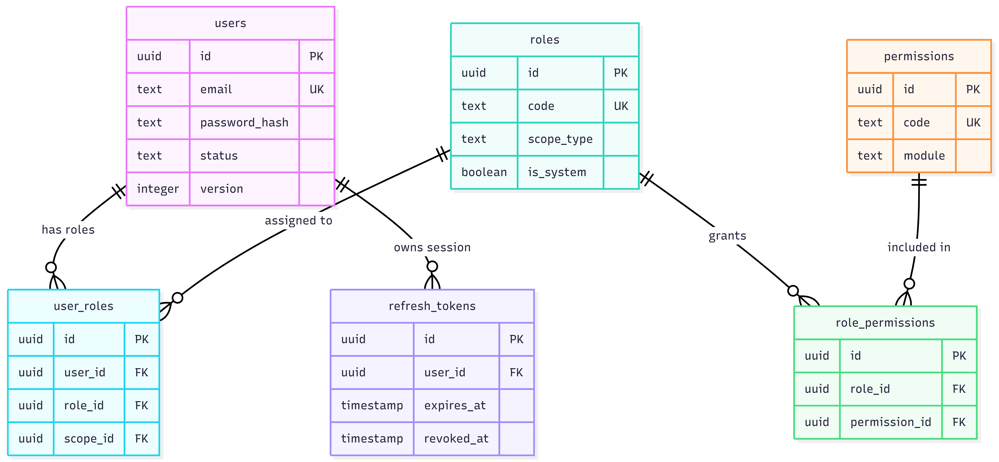 |
| audit | 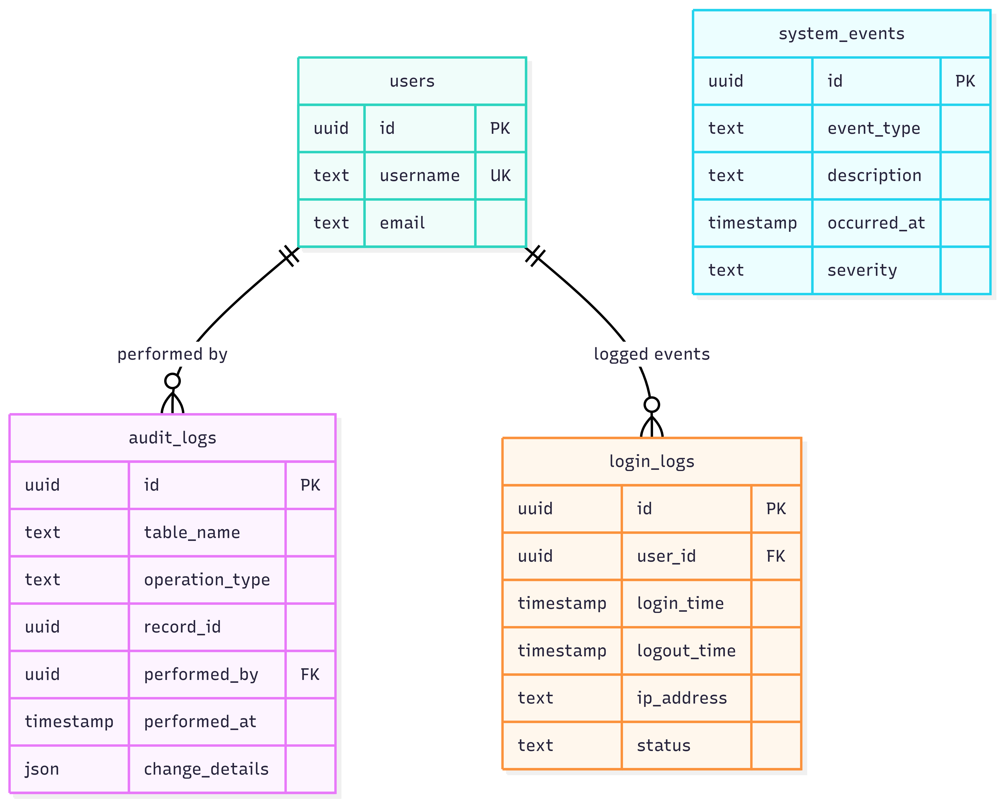 |
| academic | 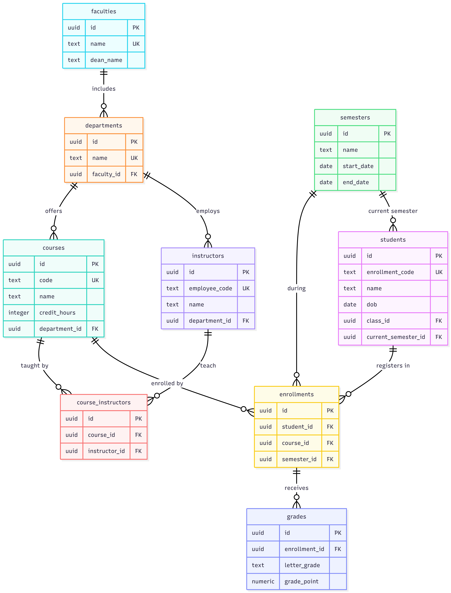 |
| hostel | 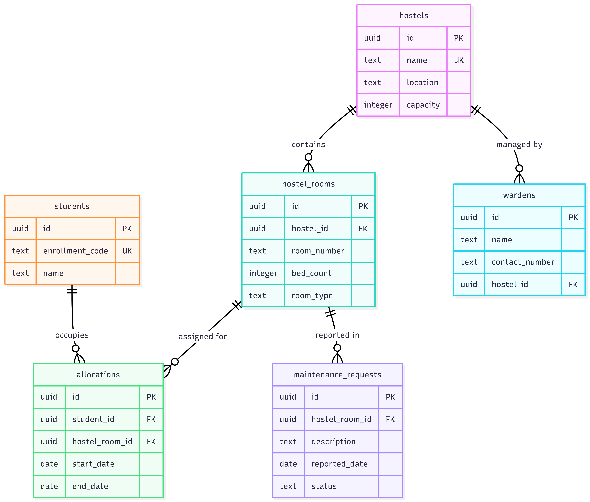 |
| library | 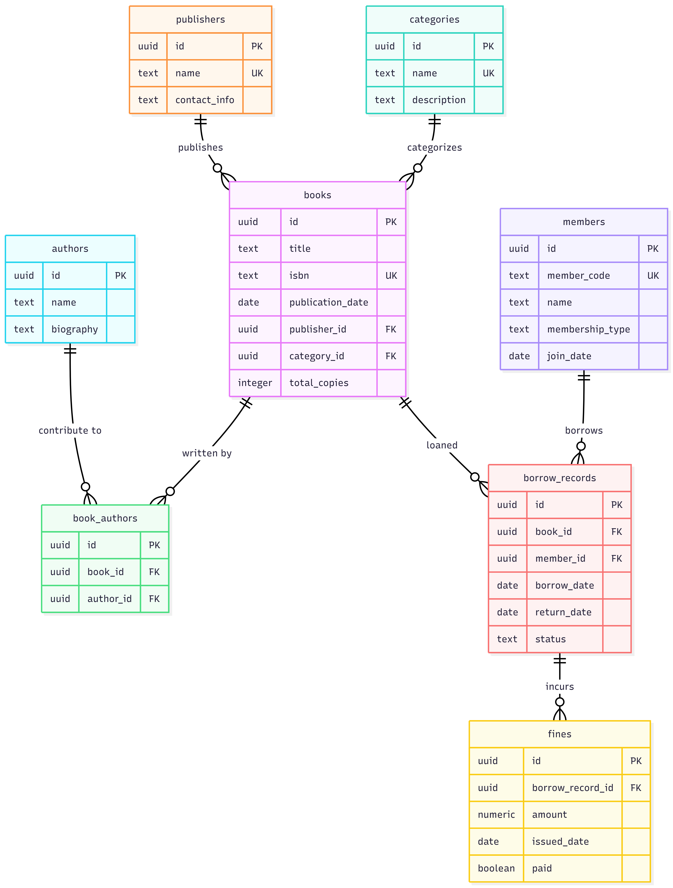 |
| exam | 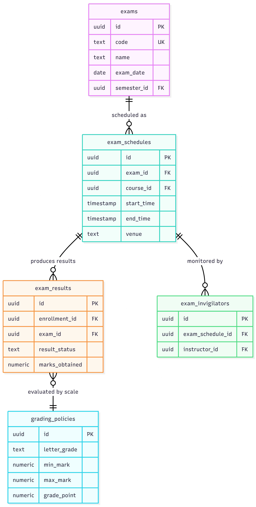 |
| admin | 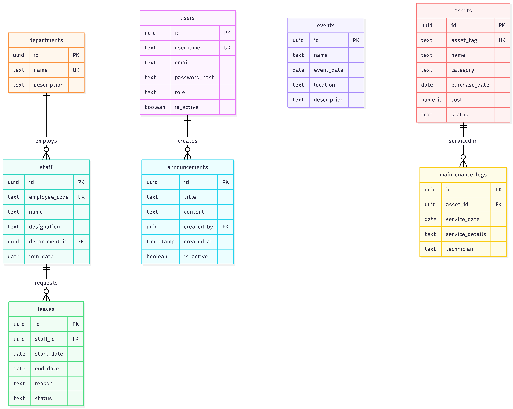 |
| core | 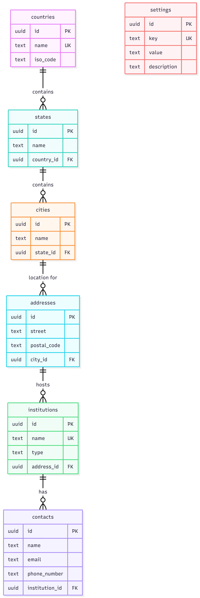 |

Combined PDFs: [UniCore_ER_Diagram.pdf](./er/by_schema/UniCore_ER_Diagram.pdf) · [unicore_erd_diagrams.pdf](./er/by_schema/unicore_erd_diagrams.pdf)
